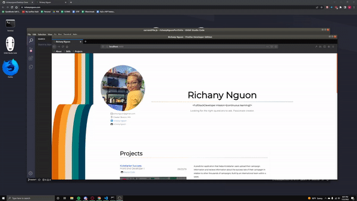

# Ubuntu UI Mock App Portfolio Site  

### Deployed  
<<<<<<< HEAD
https://portfolio-31gb9jfih-alinanguon.vercel.app/
=======
https://portfolio-31gb9jfih-alinanguon.vercel.app/   
>>>>>>> f1ab079f1565d5759b1c10874b7384e4e9107799

### Trello  
https://trello.com/b/RjEB8dt6/desktop-portfolio  

Initially this project was to explore recreating OS UI features sans any added libraries to take care of it. Later on I needed a portfolio project - so I adjusted the MVP to fit that as well.
